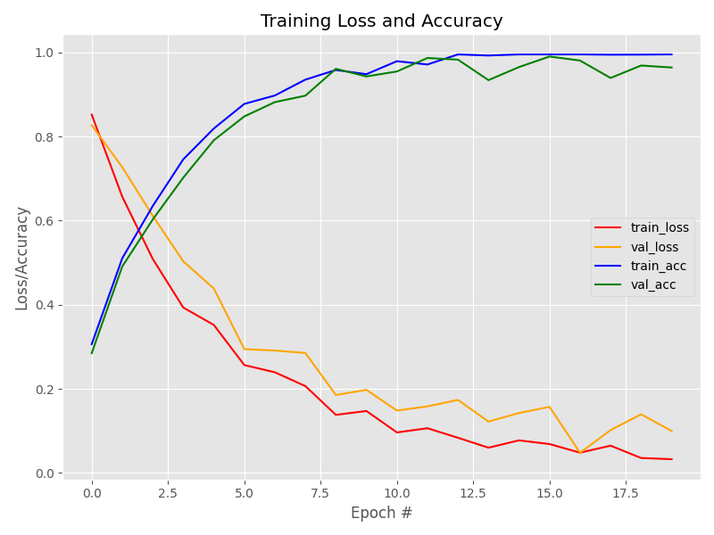

# MaskGuard AI: Real-Time Face Mask Detection Web App

A powerful deep learning-based system for detecting whether individuals are wearing face masks in real-time. This project uses a convolutional neural network (MobileNetV2) for mask classification and a custom Flask web server with a dynamic JavaScript frontend to provide a premium user experience and live analytics dashboard.

---

## Features

- **Real-Time Video Streaming**: Seamlessly streams your webcam to a browser window via a Python Flask backend.
- **Deep Learning Classification**: Built on top of Keras and TensorFlow using the MobileNetV2 architecture.
- **OpenCV Face Detection**: Uses an SSD (Single Shot MultiBox Detector) framework for lightning-fast face localization before passing frames to the classifier.
- **Live Analytics Dashboard**: A sleek, dark-mode web UI with glassmorphism aesthetics that actively polls the backend API to show you real-time metrics (Masks Detected, Violations, and AI Confidence).

---

## Installation

1. **Clone the repository:**
   ```bash
   git clone https://github.com/username/facemask-detection.git
   cd facemask-detection
   ```

2. **Install the dependencies:**
   Make sure you have Python 3 installed. Then, run:
   ```bash
   pip install -r requirements.txt
   ```

3. **Download OpenCV Face Detector:**
   The project requires the OpenCV face detector model. If it's missing, create a `face_detector` folder and download `deploy.prototxt` and `res10_300x300_ssd_iter_140000.caffemodel` from the official OpenCV repository.

---

## Usage

To start the MaskGuard AI web application:

1. Open your terminal in the project directory.
2. Run the Flask server:
   ```bash
   python app.py
   ```
3. Open your web browser and navigate to: **[http://127.0.0.1:5000](http://127.0.0.1:5000)**
4. Click **Start Detection** on the web page to activate the camera and view the live analytics!

*(Note: The legacy desktop UI can still be run directly via `python detect_mask_video.py` if preferred).*

---

## Project Architecture

- `app.py`: The main Flask web server that handles the OpenCV stream, AI inference, and exposes a `/stats` JSON endpoint.
- `detect_mask_video.py`: The legacy script for running detection natively in an OpenCV desktop window.
- `train_mask_detector.py`: The training script used to generate the `mask_detector.h5` model from a dataset of images.
- `templates/index.html`: The HTML structure for the web interface.
- `static/style.css`: The Vanilla CSS file powering the dark-mode aesthetic.
- `static/script.js`: The Vanilla JS logic that handles starting/stopping the stream and polling the live analytics API.

---

## Model Architecture & Performance

The mask classification model uses **MobileNetV2** as its base model. We apply transfer learning by freezing the base model layers and adding a fully connected head to output a binary classification (Mask vs. No Mask). It is lightweight, making it incredibly fast for real-time video applications.

### Training Accuracy
The model was trained over 20 epochs, achieving ~99% accuracy on the test set while minimizing loss to near-zero.


